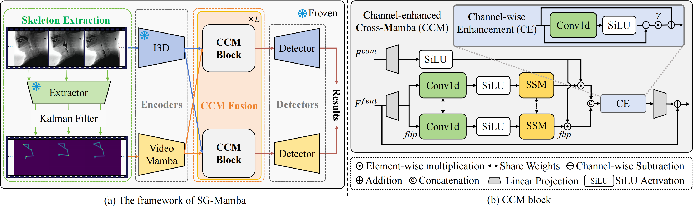

# Official code for SG-Mamba

> **Temporal Micro-action Localization with Skeleton-Guided Mamba for Videofluoroscopic Swallowing Study**  \
[Yirui Li](https://github.com/LStriving), [Kai Zhou](https://scholar.google.com/citations?user=58UyQ9cAAAAJ&hl=zh-CN&oi=ao), [Meng Dai](https://orcid.org/0000-0001-8275-572X), [Haiyu Zhou](https://loop.frontiersin.org/people/1320354/overview), [Jinwu Hu](https://scholar.google.com/citations?user=XmqjPi0AAAAJ&hl=en), [Yifan Yang](https://scholar.google.com/citations?user=veb6adUAAAAJ&hl=zh-CN&oi=ao), [Jian Chen](https://www.scholat.com/ellachen.en), [Fei Liu](https://scholar.google.com/citations?user=gC-YMYgAAAAJ&hl=en), and [Mingkui Tan](https://tanmingkui.github.io/) \
South China University of Technology, The Third Affiliated Hospital of Sun Yat-sen University, Guangdong Provincial People's Hospital 

## 📢 News
- [2025/06/18] 🤗 Extractor checkpoints have been migrated to Hugging Face. You can obtain weights from [sg-mamba](https://huggingface.co/LStriving/sg-mamba).
- [2025/06/18] 🔥 Code is released.
- [2025/05/15] 📕 The supplementary material is available at [supplementary](./assets/Supplementary.pdf).
- [2025/05/13] 🔄 The repository is created.

## Abstract

Videofluoroscopic Swallowing Study (VFSS)
is the gold standard for assessing swallowing disorders,
enabling detailed analysis of swallowing phases. Temporal
micro-action localization in VFSS, which needs to identify
and localize micro-actions (e.g., hyoid motion, {'<'}2s), is
critical for diagnosis but faces significant challenges due
to spatial ambiguity in noisy X-ray images and the extremely short duration of micro-actions. Existing methods
handle brief actions by either localizing swallowing events
before identifying micro-actions or trimming videos for focused analysis. However, they rely solely on appearance-
based data that are highly susceptible to noise and back-
ground interference. To this end, we propose Skeleton-
Guided Mamba for Temporal Micro-Action Localization (SG-
Mamba). Our method incorporates a novel skeleton modality that encodes the motion of key anatomical landmarks as
heatmap sequences, effectively suppressing noise and enhancing anatomical focus. We further introduce a Channel-
enhanced Cross-Mamba (CCM) module that fuses these
skeleton representations with traditional appearance features, enabling efficient cross-modal spatiotemporal modeling with linear complexity. Our framework achieves state-
of-the-art performance, surpassing the previous method by
14.4% in average mAP.

## Installation

Please refer to [INSTALL.md](docs/INSTALL.md) for installation.

## Performance

Comparison with State-of-the-Art Methods.
The best performances are highlighted in **bold**.
"Ske." denotes skeleton input. Temporal action localization methods are applied **as-is** to VFSS for temporal micro-action localization.

| Method            | Detector     | Ske. | 0.1      | 0.2      | 0.3      | 0.4      | 0.5      | 0.6      | 0.7      | Avg.     |
| ----------------- | ------------ | ---- | -------- | -------- | -------- | -------- | -------- | -------- | -------- | -------- |
| A2Net             | A2Net        |      | 53.7     | 51.5     | 45.7     | 36.0     | 22.4     | 10.6     | 3.5      | 31.9     |
| ActionFormer      | ActionFormer |      | 76.8     | 74.4     | 69.7     | 59.3     | 48.8     | 38.5     | 24.6     | 56.0     |
| TriDet            | TriDet       |      | 79.6     | 76.6     | 72.4     | 63.7     | 53.1     | 40.9     | 26.2     | 58.9     |
| AdaTAD            | AdaTAD       |      | 81.0     | 77.4     | 70.0     | 62.3     | 54.4     | 42.1     | 24.8     | 58.9     |
| ActionMamba       | ActionMamba  |      | 82.0     | 79.3     | 74.3     | 67.4     | 53.1     | 37.1     | 19.9     | 59.0     |
| Ruan et al.       | A2Net        |      | 70.9     | 67.5     | 62.5     | 55.0     | 46.1     | 31.6     | 15.8     | 49.9     |
| Ruan et al.       | ActionMamba  |      | 77.9     | 75.0     | 69.5     | 62.2     | 54.8     | 45.2     | 28.9     | 59.1     |
| Hyder et al.      | ActionMamba  | ✓    | 76.8     | 74.6     | 69.4     | 62.0     | 56.2     | 45.2     | 30.8     | 59.3     |
| SG-Mamba (Ours)   | Actionformer | ✓    | 82.7     | **80.1** | **75.9** | 67.1 | 58.4 | 49.2 | 33.5 | 63.8 |
| SG-Mamba (Ours)   | ActionMamba  | ✓    | **83.1**   | 78.5     | **74.6**   | **67.9**   | **59.0**   | **50.0**   | **37.2**   | **64.3**   |

## Data Preparation

Please follow the instructions in [DATASET.md](docs/DATASET.md) for data preparation

## Checkpoints

### Extractors

**I3D Extractor**: The I3D extractor is used to extract the appearance features from the input video frames. The pre-trained weights can be downloaded from [hugging face](https://huggingface.co/LStriving/sg-mamba/blob/main/pretrained_swallow_i3d.pth). After downloading, please place the file in the `pretrained` directory.

**Skeleton Extractor**: The skeleton extractor is used to extract the skeleton features from the input video frames. The pre-trained weights can be downloaded from [hugging face](https://huggingface.co/LStriving/sg-mamba/blob/main/best_model_trace.pt). After downloading, please place the file in the `pretrained/heatmap` directory.

## Training

The training instruction is in [TRAIN.md](docs/TRAIN.md).

## Evaluation

The evaluation instruction is in [EVAL.md](docs/EVAL.md).

